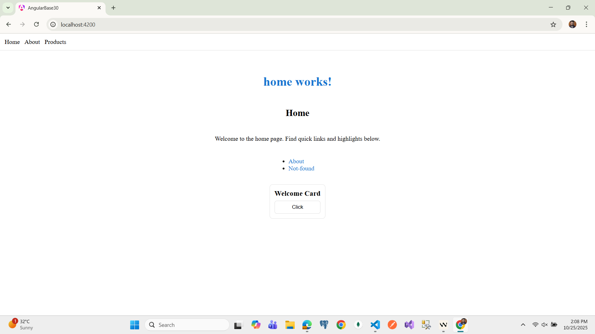
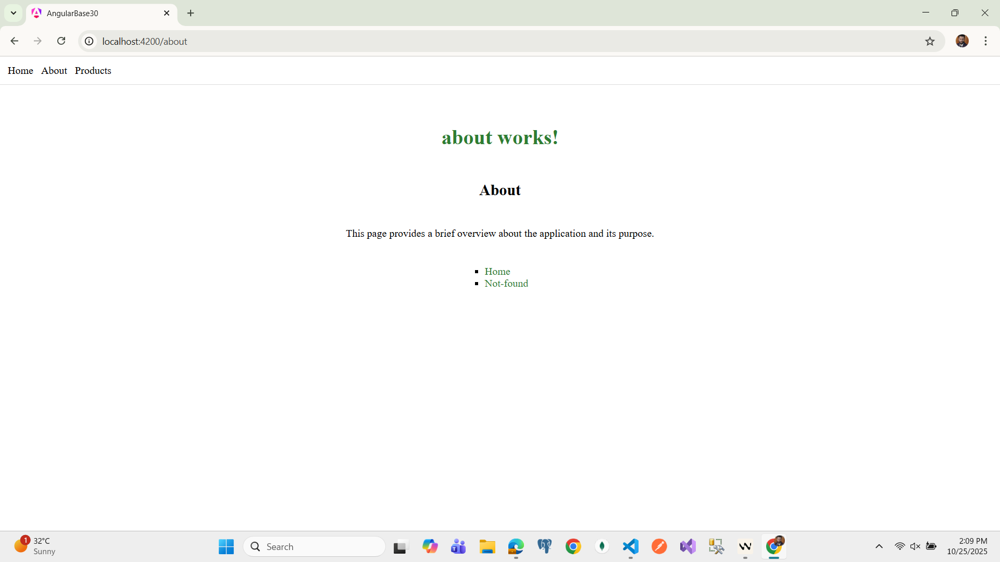
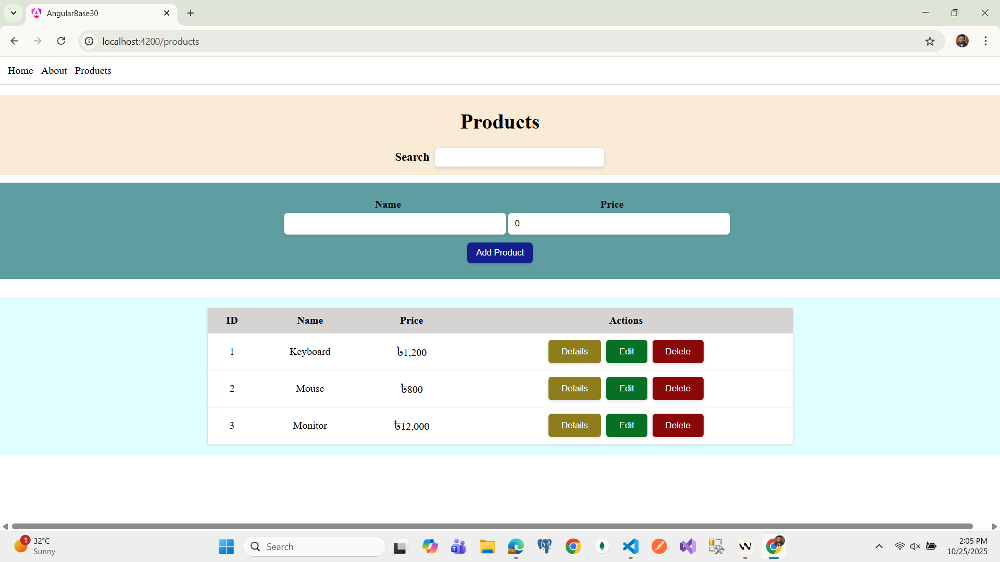

# AngularBase30

An Angular 16/20 project demonstrating a basic product catalog with Home, About, and Products pages. The app uses standalone components, reactive forms, a custom price pipe, and a simple in-memory data service. Styling is implemented entirely with SCSS (no external CSS libraries), including centered layouts and full-bleed sections.

## Screenshots

Below are sample views from the app. Images are located under `public/` and served statically.







## Features

- **Home/About/Not Found** basic pages with centered SCSS layouts
- **Products list** with search, add, edit, delete, and details
- **Reactive form** for product create/update (name and price validation)
- **Custom pipe** `price` for formatting numbers as currency
- **Pure SCSS styling** (no external CSS frameworks). Uses component-level SCSS and selective full-bleed sections
- **Static assets** served from `public/` (including `assets/products.json`)

## Tech Stack

- Angular CLI 20.3.x (Angular v16/17 compatible tooling)
- Standalone components and feature-based folders
- TypeScript 5.9
- SCSS for styling

## Getting Started

1. Install dependencies:
   ```bash
   npm install
   ```

2. Start the dev server:
   ```bash
   ng serve -o
   ```
   The app will open at `http://localhost:4200/` and live-reload on changes.

## Project Scripts

Commonly used scripts (see `package.json`):

- Start dev server:
  ```bash
  ng serve
  ```
- Build production bundle:
  ```bash
  ng build
  ```
- Run unit tests (if configured):
  ```bash
  ng test
  ```
- Lint (Angular ESLint):
  ```bash
  npm run lint
  ```
- Format (Prettier):
  ```bash
  npm run format
  ```

## Linting & Formatting

- ESLint configured via Angular ESLint (`angular-eslint`).
- Prettier used for code formatting. Recommended workflow:
  - Run `npm run lint` to check code style and potential issues.
  - Run `npm run format` to format TypeScript/HTML/SCSS files.

## Project Structure

- `src/app/`
  - `features/home/pages/*` — Home, About, Contact, Register, Not Found
  - `features/products/pages/list/*` — Products list page (search, form, table)
  - `shared/components/card/*` — Reusable card component
  - `shared/pipes/price/*` — `price` pipe
- `public/` — Static files and images (also `assets/products.json` data)

## Data

Product data is loaded from `public/assets/products.json`. In a real application, this would be replaced with an API service.

## Notes on Styling

- All styles are written in SCSS. Inline styles and presentational HTML attributes have been removed.
- Some sections (e.g., headers or table containers) use full-bleed background techniques within padded containers to achieve edge-to-edge colored bands while keeping content centered.

## Troubleshooting

- If SCSS changes are not reflected, ensure `sass` is installed:
  ```bash
  npm i -D sass
  ```
  Then restart the dev server and hard refresh the browser.

## License

This project is for educational/demo purposes.

```bash
ng build
```

## Project Structure

```
└── 📁src
    └── 📁app
        └── 📁core
            └── 📁guards
            └── 📁interceptors
            └── 📁services
                ├── logger.service.ts
        └── 📁features
            └── 📁home
                └── 📁pages
                    └── 📁about
                        ├── about.html
                        ├── about.scss
                        ├── about.ts
                    └── 📁contact
                        ├── contact.html
                        ├── contact.scss
                        ├── contact.ts
                    └── 📁home
                        ├── home.html
                        ├── home.scss
                        ├── home.ts
                    └── 📁not-found
                        ├── not-found.html
                        ├── not-found.scss
                        ├── not-found.ts
                    └── 📁register
                        ├── register.html
                        ├── register.scss
                        ├── register.ts
            └── 📁products
                └── 📁data
                    ├── products.service.ts
                └── 📁pages
                    └── 📁list
                        ├── list.html
                        ├── list.scss
                        ├── list.ts
        └── 📁shared
            └── 📁components
                └── 📁card
                    ├── card.html
                    ├── card.scss
                    ├── card.ts
            └── 📁directives
            └── 📁models
            └── 📁pipes
                └── 📁price
                    ├── price.pipe.ts
        ├── app.config.ts
        ├── app.html
        ├── app.routes.ts
        ├── app.scss
        ├── app.ts
    └── 📁environments
        ├── environment.development.ts
        ├── environment.ts
    ├── index.html
    ├── main.ts
    └── styles.scss
    
```

## Naming Rules

- Components/directives/pipes/selectors: kebab-case for file names (e.g., `card.component` → `card.ts` here as standalone)
- Classes/interfaces/enums: PascalCase (e.g., `LoggerService`, `HomeComponent`)
- Files: kebab-case (e.g., `logger.service.ts`, `price.pipe.ts`)
- Folders: kebab-case

This will compile your project and store the build artifacts in the `dist/` directory. By default, the production build optimizes your application for performance and speed.

## Running unit tests

To execute unit tests with the [Karma](https://karma-runner.github.io) test runner, use the following command:

```bash
ng test
```

## Running end-to-end tests

For end-to-end (e2e) testing, run:

```bash
ng e2e
```

Angular CLI does not come with an end-to-end testing framework by default. You can choose one that suits your needs.

## Additional Resources

For more information on using the Angular CLI, including detailed command references, visit the [Angular CLI Overview and Command Reference](https://angular.dev/tools/cli) page.
